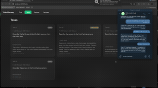

# VideoMemory

A video monitoring system that uses vision-language models to analyse camera feeds. You create **tasks** describing what to watch for, and the system continuously analyses the video stream — counting events, detecting conditions, and triggering actions like Discord notifications.

## Quick Start

```bash
uv run flask_app/app.py
```

Open http://localhost:5050. Set your model API key in the **Settings** tab. Chat with the admin agent in the **Chat** tab to manage the system through natural conversation, or browse your cameras and monitoring tasks directly in the **Devices** and **Tasks** tabs.

## Telegram

Text the system from anywhere — your phone, laptop, tablet — through Telegram. Send messages and receive real-time updates from your monitoring tasks on any device, wherever you are.



Create a bot with **@BotFather** in Telegram, paste the **Bot Token** in Settings, then restart the app. Open a chat with your bot and send a message to add tasks, list devices, and so on. The app uses long polling by default (no public URL needed). With a public URL you can set the bot webhook to `https://your-server/api/telegram/webhook` instead.

## CLI Mode

```bash
uv run videomemory/main.py
```

Same admin agent, but in your terminal. Requires a `GOOGLE_API_KEY` environment variable or `.env` file.

---

## Raspberry Pi Deployment

SSH into your Pi and run:

```bash
curl -sSL https://raw.githubusercontent.com/Clamepending/videomemory/main/deploy/setup-pi.sh | bash
```

This installs VideoMemory as a background service that starts on boot. When it finishes it prints the URL (e.g. `http://192.168.1.42:5050`). Open it and set your API key in the **Settings** tab.

```bash
sudo systemctl status videomemory     # check status
sudo systemctl restart videomemory    # restart
sudo journalctl -u videomemory -f     # view logs
```

---

## OpenClaw Agent Setup

1. Install [OpenClaw](https://openclaw.ai/)
2. Tell your agent:

> Clone https://github.com/Clamepending/videomemory and read the `AGENTS.md` file to onboard to the VideoMemory system.

If VideoMemory is already running on a Pi or other machine, add the server URL:

> The VideoMemory server is running at http://YOUR_PI_IP:5050. Read the `AGENTS.md` file at https://github.com/Clamepending/videomemory to onboard.
