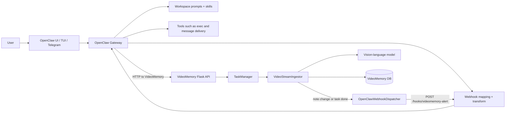
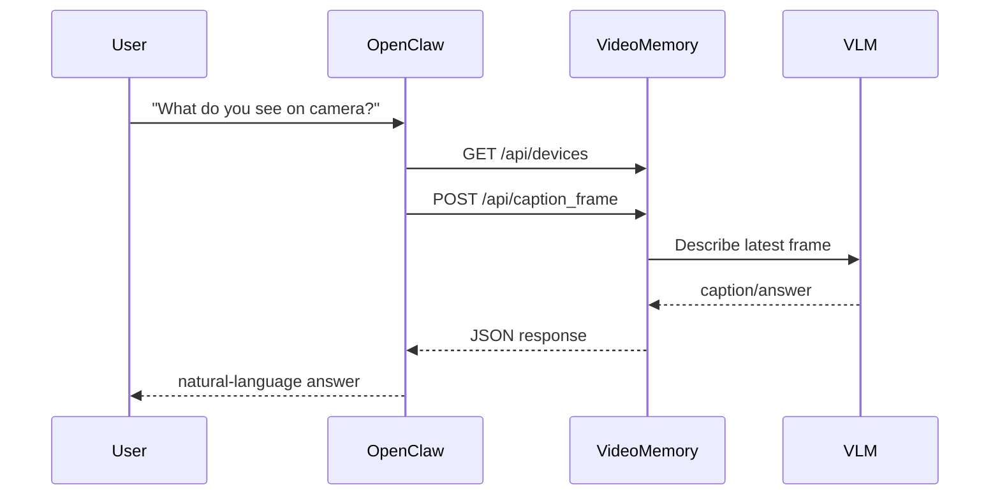

# OpenClaw Architecture and VideoMemory Integration

This document explains how OpenClaw works in the context of this repository, and exactly how it interacts with VideoMemory.

It is written for someone who wants a systems-level understanding, not just "how to run it."

## Scope and Source-of-Truth Notes

There are three different kinds of facts in this document:

- Repo-verified facts: things directly visible in this repository's code, config, scripts, and checked-in runtime files.
- OpenClaw-doc facts: things confirmed from the official OpenClaw docs.
- Inference: careful deductions from the repo and docs together.

Important caveat:

- This repo does **not** vendor OpenClaw's upstream source code.
- The real bundled stack runs `alpine/openclaw:latest` from Docker, so the exact upstream OpenClaw revision is **not pinned** here.
- That means the most trustworthy source for the integration is this repo, but the most trustworthy source for OpenClaw internals is the official OpenClaw docs.

Because of that, this document is explicit about where the boundary is:

- OpenClaw is the conversation, session, tool-use, and webhook orchestration layer.
- VideoMemory is the camera/device, perception, task-state, and note-generation layer.

## TL;DR Mental Model

If you want the shortest correct summary:

- OpenClaw is the agent runtime and orchestration shell.
- VideoMemory is the vision monitoring backend.
- OpenClaw turns user intent into HTTP calls against VideoMemory.
- VideoMemory turns camera frames into semantic task notes.
- When a note changes, VideoMemory can POST a webhook back into OpenClaw.
- OpenClaw then decides whether to say nothing, reply in chat, or send a Telegram alert.

In control-systems language:

- VideoMemory is the perception subsystem.
- OpenClaw is the policy and actuation subsystem.
- The webhook is the event bus between them.
- The helper script is the local controller memory that keeps "when X happens, do Y" logic split across the two systems.

## High-Level Architecture



## What "OpenClaw" Means in This Repo

This repo contains **two different OpenClaw-related stacks**.

### 1. The real OpenClaw stack

Defined in [`docker-compose.real-openclaw.yml`](../docker-compose.real-openclaw.yml).

This is the important one if you want the actual OpenClaw architecture:

- Uses Docker image `alpine/openclaw:latest`
- Runs the real OpenClaw gateway process
- Mounts a pre-seeded OpenClaw home from [`deploy/openclaw-real-home`](../deploy/openclaw-real-home)
- Patches the runtime at startup with [`patch-openclaw-runtime.mjs`](../deploy/openclaw-real-home/hooks/bin/patch-openclaw-runtime.mjs)

Command used inside the container:

```sh
node /home/node/.openclaw/hooks/bin/patch-openclaw-runtime.mjs && exec node /app/openclaw.mjs gateway --allow-unconfigured
```

### 2. The legacy/test "OpenClaw" stack

Defined in [`docker-compose.openclaw.yml`](../docker-compose.openclaw.yml).

This is **not** the real OpenClaw runtime. It builds `../simpleagent` and uses that container as an OpenClaw-like agent for testing.

That older stack still matters because:

- it shows the intended behavior of the integration
- it contains older bot-context files in [`deploy/openclaw-bot-context/openclaw`](../deploy/openclaw-bot-context/openclaw)

But if you want to understand actual OpenClaw architecture, treat the real stack as authoritative and the SimpleAgent stack as historical scaffolding.

## OpenClaw Core Architecture

This section is mostly OpenClaw-doc facts plus repo-specific configuration.

### Gateway

OpenClaw's central process is the **Gateway**.

From the official docs, the Gateway is the long-running process that owns:

- sessions
- channel connections
- hook/webhook handling
- UI/control-plane access
- message routing
- tool wiring

In the real bundle:

- container port `18789` is OpenClaw's own port
- host port `18889` maps to it
- config is in [`deploy/openclaw-real-home/openclaw.json`](../deploy/openclaw-real-home/openclaw.json)

Key `gateway` settings in this repo:

- `mode: "local"`
- `port: 18789`
- `bind: "lan"`
- token auth for the dashboard/control plane
- control UI enabled

Important security note:

- `controlUi.allowInsecureAuth` is enabled
- `controlUi.dangerouslyDisableDeviceAuth` is enabled

That makes sense for a local dev/demo stack, but it is intentionally weaker than a production-hardened deployment.

### Agent runtime

Per the official docs:

- OpenClaw's gateway owns session management, channel delivery, hook routing, and the system-prompt assembly around model/tool execution.
- The gateway invokes agent runs inside that sessioned runtime rather than acting like a stateless HTTP proxy.

Relevant consequences for this integration:

- The model does not directly "know VideoMemory" unless OpenClaw injects the VideoMemory skill or workspace guidance.
- In practice, session continuity matters enough that routing multiple alerts into one shared session changes the resulting agent behavior.

### System prompt and workspace context

OpenClaw builds the system prompt fresh on every run.

From the official docs, the prompt is assembled from:

- OpenClaw's base prompt
- tool guidance
- skill metadata and eligible skills
- injected workspace files
- runtime metadata and overrides

The workspace files OpenClaw injects by default include:

- `AGENTS.md`
- `SOUL.md`
- `TOOLS.md`
- `IDENTITY.md`
- `USER.md`
- `HEARTBEAT.md`
- `BOOTSTRAP.md` on first run

In the real bundle, these live under [`deploy/openclaw-real-home/workspace`](../deploy/openclaw-real-home/workspace).

That means the behavior of bundled OpenClaw is shaped by **more than just `openclaw.json`**. It is also shaped by the checked-in workspace prompt files.

### Skills

In OpenClaw, a skill is not a tool and not a plugin.

A skill is a `SKILL.md` file that teaches the agent:

- when to use a workflow
- which tools to call
- how to sequence them
- what constraints to obey

OpenClaw docs describe skills as prompt-time workflow documents. In practice, the agent is expected to discover a relevant skill and read the corresponding `SKILL.md` when needed.

Skill locations, per OpenClaw docs, include:

- workspace skills
- project agent skills
- personal agent skills
- managed/local `~/.openclaw/skills`
- bundled skills

For this integration, the key skill is the VideoMemory skill:

- repo source: [`docs/openclaw-skill.md`](../docs/openclaw-skill.md)
- bundled real-home copy: [`deploy/openclaw-real-home/skills/videomemory/SKILL.md`](../deploy/openclaw-real-home/skills/videomemory/SKILL.md)
- workspace copy: [`deploy/openclaw-real-home/workspace/skills/videomemory/SKILL.md`](../deploy/openclaw-real-home/workspace/skills/videomemory/SKILL.md)

That skill tells OpenClaw things like:

- which VideoMemory base URL to use
- how to translate `localhost` to Docker-safe URLs
- when to use `/api/caption_frame`
- when to create direct tasks
- when to use the helper for split trigger/action monitoring

### Tools

In the real stack, tool policy matters a lot.

From [`openclaw.json`](../deploy/openclaw-real-home/openclaw.json):

- `tools.profile` is `"coding"`
- `web_fetch` is denied
- `exec` runs on the gateway host
- `exec.security` is `"full"`
- `exec.ask` is `"off"`

So the bundled agent is intentionally allowed to use a full shell without approval.

This is why the VideoMemory skill repeatedly tells OpenClaw to use `curl` via shell instead of a browser/web-fetch tool for local/private URLs.

### Channels

The bundle enables Telegram in [`openclaw.json`](../deploy/openclaw-real-home/openclaw.json).

That matters because the transform can choose to:

- deliver into a chat session
- deliver through Telegram
- keep the result internal

### Sessions

Sessions are a big part of this integration.

From the official OpenClaw docs:

- OpenClaw organizes conversations into sessions.
- Webhooks normally map to isolated hook sessions.
- Session state lives under `~/.openclaw/agents/<agentId>/sessions/`.
- Transcripts are JSONL files.

In this repo, sessions matter in three distinct ways:

1. User-facing conversation sessions
2. Hook-created webhook sessions
3. Explicit rerouting from hook flow back into a chosen user session

The important session keys in this integration are:

- `hook:videomemory:...` for webhook-originated work
- `agent:main:main` for the main shared chat session

That distinction is central to how alert routing works.

## The Pre-Seeded OpenClaw Home Directory

The directory [`deploy/openclaw-real-home`](../deploy/openclaw-real-home) is not just a static config folder. It is effectively a checked-in `~/.openclaw` home volume.

That is architecturally important.

It contains:

- config: [`openclaw.json`](../deploy/openclaw-real-home/openclaw.json)
- workspace prompts: [`workspace`](../deploy/openclaw-real-home/workspace)
- skills: [`skills`](../deploy/openclaw-real-home/skills)
- hook executables: [`hooks/bin`](../deploy/openclaw-real-home/hooks/bin)
- hook transforms: [`hooks/transforms`](../deploy/openclaw-real-home/hooks/transforms)
- hook runtime state: [`hooks/state`](../deploy/openclaw-real-home/hooks/state)
- session store and transcripts: [`agents/main/sessions`](../deploy/openclaw-real-home/agents/main/sessions)
- memory database: [`memory`](../deploy/openclaw-real-home/memory)
- credentials/device/telegram/runtime state directories

This has two implications:

- The bundle is reproducible because it mounts a known OpenClaw home layout.
- The repo also contains runtime artifacts that are normally operational state, not source code.

Security implication:

- checked-in session transcripts, credentials, and runtime state should be treated carefully
- the directory is much closer to a live user profile than to a minimal config template

## VideoMemory Components Relevant to OpenClaw

Now the VideoMemory side.

### Flask app

[`flask_app/app.py`](../flask_app/app.py) does three important OpenClaw-related things:

1. It wires `OpenClawWebhookDispatcher` into the `TaskManager`.
2. It exposes the normal VideoMemory HTTP API under `/api/*`.
3. It serves integration assets:
   - `/openclaw/skill.md`
   - `/openclaw/videomemory-task-helper.mjs`
   - `/openclaw/bootstrap.sh`
   - `/openclaw/install-videomemory.sh`

So VideoMemory is not just a backend for cameras. It is also the distribution point for OpenClaw integration assets.

### TaskManager

[`videomemory/system/task_manager.py`](../videomemory/system/task_manager.py) is the main task orchestration layer on the VideoMemory side.

For this integration, the most important behavior is:

- it accepts a callback `on_detection_event`
- the Flask app passes `openclaw_dispatcher.dispatch_task_update`
- it creates per-camera `VideoStreamIngestor` instances
- it persists tasks and notes
- on restart, previously active tasks are marked `terminated`

That restart behavior is easy to miss and very important:

- VideoMemory does **not** transparently resume live monitoring tasks after a restart.
- It loads persisted tasks from DB, but active ones are converted to terminated because no ingestor is still running.

### VideoStreamIngestor

[`videomemory/system/stream_ingestors/video_stream_ingestor.py`](../videomemory/system/stream_ingestors/video_stream_ingestor.py) is where frame analysis and task-note emission actually happen.

Important internal distinction:

- `task_id` is the stable external identifier exposed in the HTTP API and webhooks
- `task_number` is the transient per-ingestor index used inside model prompts/results

That is why the code:

- assigns `task_number` when the task is added to an ingestor
- renumbers active tasks after completed tasks are pruned
- still uses stable `task_id` for webhook payloads and HTTP lookups

This is a subtle but crucial architectural detail:

- the model-facing control loop is indexed by `task_number`
- the user-facing and agent-facing control plane is indexed by `task_id`

### OpenClawWebhookDispatcher

[`videomemory/system/openclaw_integration.py`](../videomemory/system/openclaw_integration.py) is the bridge from VideoMemory into OpenClaw.

Its job is:

- read webhook config from environment
- build a stable event payload
- dedupe recently successful events
- optionally rate-limit sends
- POST JSON to OpenClaw

Config environment variables include:

- `VIDEOMEMORY_OPENCLAW_WEBHOOK_URL`
- `VIDEOMEMORY_OPENCLAW_WEBHOOK_TOKEN`
- `VIDEOMEMORY_OPENCLAW_WEBHOOK_TIMEOUT_S`
- `VIDEOMEMORY_OPENCLAW_DEDUPE_TTL_S`
- `VIDEOMEMORY_OPENCLAW_MIN_INTERVAL_S`
- `VIDEOMEMORY_OPENCLAW_BOT_ID`

The dispatcher only sends an event when:

- a new note was emitted, or
- a task was marked done

It intentionally skips:

- "nothing changed and task is not done"

That matters because it keeps OpenClaw from being spammed by every loop iteration.

## The Real Integration Contract

The best way to think about the interface is:

- OpenClaw -> VideoMemory is **plain HTTP**
- VideoMemory -> OpenClaw is **authenticated webhook POST**

The repo's agent contract is documented in [`docs/agent-integration-contract.md`](../docs/agent-integration-contract.md).

### OpenClaw -> VideoMemory

OpenClaw uses:

- `GET /api/health`
- `GET /api/devices`
- `POST /api/devices/network`
- `DELETE /api/devices/network/{io_id}`
- `GET /api/tasks`
- `POST /api/tasks`
- `GET /api/task/{task_id}`
- `PUT /api/task/{task_id}`
- `POST /api/task/{task_id}/stop`
- `DELETE /api/task/{task_id}`
- `GET /api/settings`
- `PUT /api/settings/{key}`
- `POST /api/caption_frame`

### VideoMemory -> OpenClaw

VideoMemory posts to:

- `http://openclaw:18789/hooks/videomemory-alert` inside the Docker network

In the real bundle, that is configured by:

- [`docker-compose.real-openclaw.yml`](../docker-compose.real-openclaw.yml) on the VideoMemory side
- [`deploy/openclaw-real-home/openclaw.json`](../deploy/openclaw-real-home/openclaw.json) on the OpenClaw side

## End-to-End Flows

### Flow 1: one-off camera question

Example: "what do you see on camera?"



Important point:

- OpenClaw is not expected to fetch raw images and do separate vision here.
- The skill explicitly says to prefer `/api/caption_frame` so the reasoning stays inside VideoMemory's configured vision path.

### Flow 2: direct record-only monitoring

Example: "watch for a red marker and record it"

Flow:

- OpenClaw calls `POST /api/tasks`
- VideoMemory stores a monitoring task
- the ingestor emits notes when the VLM says something changed
- notes are saved to the database
- a webhook may also be sent to OpenClaw if configured

This is the simplest integration mode.

### Flow 3: split trigger plus action monitoring

Example: "when you see a backpack, tell me here"

This is the most important flow in the whole integration.

The design choice is:

- VideoMemory should own only the visual trigger condition
- OpenClaw should own the follow-up action

So the user request is split into:

- trigger condition for VideoMemory
- action instruction for OpenClaw

Why split it?

- VideoMemory is good at detecting and recording visual state changes.
- OpenClaw is good at conversational follow-up, tool use, and channel delivery.
- If the action needs fresh state, tools, search, or messaging, it should happen at trigger time inside OpenClaw, not be baked into a stale setup-time note.

### Flow 4: task done event

If the ingestor emits `task_done: true` with no new note:

- VideoMemory still persists the done state
- VideoMemory still emits the OpenClaw detection callback
- the dispatcher still sends a webhook

This is intentional and is covered by tests in [`tests/test_video_stream_ingestor_detection_callbacks.py`](../tests/test_video_stream_ingestor_detection_callbacks.py) and [`tests/test_openclaw_integration.py`](../tests/test_openclaw_integration.py).

### Flow 5: restart semantics

On VideoMemory restart:

- previously active tasks are marked terminated in the DB
- ingestors are not automatically resumed
- OpenClaw may still know about old tasks, but the backend will no longer be actively watching until tasks are recreated

That is an architectural limitation to remember.

## How Skills, Helpers, Webhooks, and Sessions Work Together

This is the conceptual center of the system.

### Skill

The skill teaches OpenClaw:

- how to reach VideoMemory
- which HTTP endpoints to use
- how to phrase monitoring tasks
- when to use the helper instead of raw task creation

### Helper

The helper script stores the follow-up action locally in OpenClaw state while creating a plain trigger-only VideoMemory task.

### Webhook

The webhook carries new note events from VideoMemory back into OpenClaw.

### Transform

The OpenClaw transform turns the webhook payload into a fresh agent instruction:

- either a Telegram delivery request
- or a message injected into a chosen session
- or a quiet internal acknowledgement request

### Session routing

If the user wants "tell me here in this chat," the transform must route the alert into the correct OpenClaw session, not a throwaway isolated hook session.

That is why session handling and the runtime patch exist.

## File-by-File Walkthrough

### 1. `docs/openclaw-skill.md`

This is the human-readable procedural playbook for OpenClaw.

It encodes several important policies:

- canonical base URLs for host vs Docker networking
- "do not use `web_fetch` for private/local URLs"
- prefer `curl`
- prefer `/api/caption_frame` for one-off questions
- treat VideoMemory as source of truth for devices and task state
- use the helper for "when X happens, do Y"
- keep only raw trigger conditions inside VideoMemory's `task_description`

This file is the clearest statement of the intended system behavior.

### 2. `docs/openclaw-bootstrap.sh`

This is the one-shot onboarding script for an existing OpenClaw install.

It does five major things:

1. finds or clones the VideoMemory repo
2. starts VideoMemory if it is not already reachable
3. installs integration files into OpenClaw home
4. merges the webhook mapping into `openclaw.json`
5. copies model API keys from environment into VideoMemory settings

The installed integration files are:

- helper script
- webhook transform
- VideoMemory skill

The config merge is especially important.

It ensures:

- hooks are enabled
- hook path is `/hooks`
- transforms directory is set
- request-supplied session keys are disallowed
- allowed session-key prefixes include `hook:` and `agent:`
- the default agent is allowed
- a mapping named `videomemory-alert` exists

The generated mapping looks like this in effect:

```json
{
  "id": "videomemory-alert",
  "match": { "path": "videomemory-alert" },
  "action": "agent",
  "agentId": "main",
  "wakeMode": "now",
  "name": "VideoMemory",
  "sessionKey": "hook:videomemory:{{io_id}}:{{task_id}}:{{event_id}}",
  "deliver": false,
  "transform": { "module": "videomemory-alert.mjs" }
}
```

Why this matters:

- every inbound VideoMemory event gets a unique hook session key by default
- a transform can then override how that work is actually delivered

### 3. `deploy/openclaw-real-home/openclaw.json`

This is the real-stack config.

Conceptually, it defines:

- gateway UI/auth
- provider auth profiles
- channel configuration
- default agent and model selection
- tool policy
- hook configuration

The hook configuration is the part that binds OpenClaw to VideoMemory.

Two distinct tokens matter:

- `OPENCLAW_GATEWAY_TOKEN` for the UI/control plane
- `OPENCLAW_HOOKS_TOKEN` for webhook auth

Those should be thought of as separate trust domains.

### 4. `videomemory/system/openclaw_integration.py`

This is the outbound webhook sender on the VideoMemory side.

The payload it builds contains fields like:

- `service`
- `event_type`
- `event_id`
- `idempotency_key`
- `bot_id`
- `io_id`
- `task_id`
- `task_number`
- `task_description`
- `task_status`
- `task_done`
- `note`
- `note_timestamp`
- `note_timestamp_iso`
- `notes_count`
- `observed_at`

Notable design features:

- deterministic event ID derived from bot, device, task, note, and timestamps
- duplicate suppression on successful sends
- optional minimum interval throttling
- `Authorization: Bearer ...` header when token is configured
- `Idempotency-Key` header mirrors the event ID

This is good event-bridge design: idempotent-ish, narrow payload, retry-friendly.

### 5. `deploy/openclaw-real-home/hooks/transforms/videomemory-alert.mjs`

This is the inbound brain on the OpenClaw side.

Its job is not just "pass along the webhook." It performs policy.

It does all of the following:

- dedupes events again using local hook-state storage
- loads the task-action registry if present
- decides whether the note should be suppressed
- decides whether to deliver via Telegram, session, or internal flow
- synthesizes the agent-facing prompt

This transform is where the architectural split really comes alive.

#### Registry-aware behavior

If the helper previously created a task, the transform can look up a registry entry keyed by:

- `bot_id`
- `io_id`
- `task_id`

That registry entry contains:

- trigger condition
- follow-up action
- delivery mode
- delivery target or session key
- original request context

Then the transform writes a new agent message such as:

- what the original request was
- what the authoritative action is now
- what the latest observation says
- whether the agent should reply `NO_REPLY`

Important behavior:

- if the observation is an absence/disappearance note but the stored action only cares about appearance, the transform suppresses the event
- this avoids a common false-positive class of annoying alerts

#### Delivery behavior

The transform can return:

- `deliver: true` with `channel: "telegram"`
- or `deliver: false` with a `sessionKey`
- or a quiet internal message

This is the key separation:

- VideoMemory emits facts
- OpenClaw transform applies messaging policy

#### `NO_REPLY`

The transform's generated instructions tell the agent:

- reply with exactly `NO_REPLY` if the observation does not mean the trigger is satisfied now

So the actual agent run acts like a final semantic filter.

### 6. `deploy/openclaw-real-home/hooks/bin/videomemory-task-helper.mjs`

This is the helper that creates the split trigger/action architecture.

It supports:

- `create`
- `update`
- `stop`
- `delete`

Its core behavior is:

- call VideoMemory API for task lifecycle
- maintain a local registry JSON file in OpenClaw hook state

Registry path:

- `~/.openclaw/hooks/state/videomemory-task-actions.json`

Typical registry entry fields:

- `task_id`
- `io_id`
- `bot_id`
- `task_description`
- `trigger_condition`
- `action_instruction`
- `delivery_mode`
- `delivery_source`
- `delivery_sender_id`
- `delivery_target`
- `delivery_session_key`
- `original_request`
- `created_at`
- `updated_at`

That registry is the missing half of the user request.

VideoMemory only sees:

- `trigger_condition`

OpenClaw locally keeps:

- `action_instruction`
- delivery policy
- session or Telegram routing info

#### Delivery modes

The helper supports:

- `telegram`
- `session`
- `webchat` as alias of `session`
- `internal`

Interpretation:

- `telegram`: send an external user alert
- `session`: route into a specific OpenClaw session
- `webchat`: same as session, but semantically tied to current chat/UI
- `internal`: keep it in hook flow without replying outward

#### Original request context

The real bundled helper builds a structured `original_request` when none is explicitly supplied:

```text
Trigger condition: ...
Follow-up action: ...
```

That is helpful because the later hook-triggered agent run receives both:

- the current observation
- the original user intent decomposition

### 7. `docs/openclaw-videomemory-task-helper.mjs` versus the real bundled helper

This repo currently has **two helper copies** and they have diverged.

Paths:

- served/bootstrap copy: [`docs/openclaw-videomemory-task-helper.mjs`](../docs/openclaw-videomemory-task-helper.mjs)
- real mounted copy: [`deploy/openclaw-real-home/hooks/bin/videomemory-task-helper.mjs`](../deploy/openclaw-real-home/hooks/bin/videomemory-task-helper.mjs)

This is a real architectural sharp edge.

Current difference summary:

- the `docs/` copy auto-detects the VideoMemory base URL across several candidates
- the mounted `deploy/` copy uses a single default base URL unless explicitly overridden
- the mounted `deploy/` copy builds richer `original_request` context
- the `docs/` copy does not currently build that richer default context

Why it matters:

- the bundled real Docker stack uses the `deploy/` copy because that is what gets mounted
- the bootstrap script copies the `docs/` helper into `~/.openclaw/hooks/bin/videomemory-task-helper.mjs`
- external OpenClaw installs bootstrapped from VideoMemory receive the `docs/` copy

So behavior differs depending on whether you are using:

- the bundled real stack
- or bootstrap/install flow for an external OpenClaw instance

This is one of the most important non-obvious details in the repo.

### 8. `deploy/openclaw-real-home/hooks/bin/patch-openclaw-runtime.mjs`

This script patches the compiled OpenClaw gateway bundle at container startup.

That is unusual and architecturally significant.

It does two things:

1. patches the gateway bundle so non-`hook:` and non-`cron:` session keys can target a `"shared"` session instead of always `"isolated"`
2. repairs main-session metadata in the session store when needed

The session-target patch is the especially important part.

Why it exists:

- inbound webhook work naturally starts in an isolated hook session
- but for "tell me here" behavior, the system needs to inject the resulting action into a shared user session such as `agent:main:main`
- this patch appears to make that rerouting behave the way the integration wants

Inference:

- without this patch, hook-driven alerts may not reliably land in the intended shared chat session
- or may create isolated sessions instead of continuing an existing conversation

This also introduces fragility:

- the patch looks for exact string anchors in a compiled bundle
- upstream OpenClaw updates could break the patch if the bundle structure changes

### 9. `launch_openclaw_with_videomemory.sh`

This is the developer-facing convenience launcher for the real stack.

It:

- ensures Docker is running
- validates that at least one provider API key exists
- chooses default models for VideoMemory and OpenClaw based on provider
- launches both containers
- waits for health
- prints direct URLs for VideoMemory and OpenClaw

This script is how the repo turns a lot of config complexity into a single command.

### 10. `docs/launch-openclaw-real-tui.sh`

This helper attaches to the in-container TUI:

```sh
openclaw tui --url ws://127.0.0.1:18789 --token "$OPENCLAW_GATEWAY_TOKEN" --session main
```

This is a clue about how the control plane is structured:

- the TUI talks to the gateway over WebSocket
- it authenticates with the gateway token
- it opens session `main`

## Session Architecture in This Integration

This deserves its own section.

### Why sessions matter

Without careful session handling, webhook alerts would just wake a detached agent somewhere.

But users often want one of these three behaviors:

- tell me in Telegram
- tell me here in this exact chat
- do the work internally and only reply if needed

Those are different session-routing and delivery problems.

### Default webhook session

The hook mapping's default session key is:

```text
hook:videomemory:{{io_id}}:{{task_id}}:{{event_id}}
```

That means:

- the raw webhook event is isolated
- the event stream is uniquely keyed
- retries and duplicates do not all collapse into one permanent shared hook session

This is good for containment and traceability.

### Returning work to the main session

For in-chat alerts, the helper stores something like:

```text
delivery_mode = session
delivery_session_key = agent:main:main
```

Then the transform returns that session key.

That is the mechanism by which:

- an isolated perception event
- becomes a message in the user's ongoing chat context

### Why the runtime patch exists

The patch strongly suggests the stock runtime behavior was not enough for this shared-session rerouting use case.

In other words:

- isolated hook session for intake
- shared main session for delivery

is not just a conceptual pattern; it is a runtime behavior the repo actively patches OpenClaw to support.

## Webhook Architecture in This Integration

There are two layers of webhook logic.

### Layer 1: VideoMemory dispatcher

VideoMemory decides:

- whether there was a meaningful note change or done event
- whether to suppress a recent duplicate
- whether rate limiting should suppress a send

Then it POSTs JSON to OpenClaw with bearer auth and an idempotency key.

### Layer 2: OpenClaw transform

OpenClaw decides:

- whether the event is still a duplicate
- whether it corresponds to a helper-managed split task
- whether the observation implies appearance or disappearance
- whether to alert externally
- whether to inject back into a session
- what exact message the agent should evaluate

This is a nice layered design:

- source-side event hygiene in VideoMemory
- sink-side policy and delivery in OpenClaw

## State Stores and Ownership

This is the clearest way to see the architecture.

| State | Owner | Where it lives |
| --- | --- | --- |
| Devices | VideoMemory | VideoMemory DB |
| Tasks | VideoMemory | VideoMemory DB |
| Task notes | VideoMemory | VideoMemory DB |
| Stable task IDs | VideoMemory | VideoMemory DB/API |
| Ephemeral `task_number` for VLM loop | VideoMemory | in-memory ingestor state |
| Outbound webhook dedupe cache | VideoMemory | in-memory dispatcher map |
| OpenClaw session store | OpenClaw | `~/.openclaw/agents/<agentId>/sessions/sessions.json` |
| OpenClaw transcripts | OpenClaw | `~/.openclaw/agents/<agentId>/sessions/*.jsonl` |
| Split-task action registry | OpenClaw | `~/.openclaw/hooks/state/videomemory-task-actions.json` |
| Inbound webhook dedupe state | OpenClaw | `~/.openclaw/hooks/state/videomemory-alert-dedupe.json` |
| Workspace personality/instructions | OpenClaw | `workspace/*.md` and `skills/*/SKILL.md` |

The key design takeaway is:

- OpenClaw does **not** own the perception state
- VideoMemory does **not** own the conversational action state

The system is intentionally split.

## Why the Split Design Makes Sense

For an ML/systems perspective, this design is actually pretty clean.

### Separation of concerns

VideoMemory handles:

- camera IO
- frame sampling
- VLM prompting for detection
- note persistence
- task state transitions

OpenClaw handles:

- user intent interpretation
- tool choice and orchestration
- messaging/channel delivery
- session continuity
- "what should happen now?" reasoning at alert time

### Freshness

If the action says:

- search the web
- check today's weather
- read a file
- send a current alert

that should happen when the trigger fires, not when the task is created.

The split helper design preserves that freshness.

### Semantic compression

VideoMemory emits compact semantic notes like:

- "Red marker detected in frame."
- "No backpacks visible."
- "Person left frame."

That is much cheaper and easier for OpenClaw to consume than raw frames.

But it also introduces a cost:

- OpenClaw is reasoning over **semantic summaries**, not raw visual evidence
- if the note wording is ambiguous, the action logic can be ambiguous too

### Queueing and idempotency

The two-stage dedupe plus `NO_REPLY` strategy is there to prevent:

- duplicate webhook storms
- repeated alerts for unchanged state
- noisy false triggers on disappearance notes

## Sharp Edges and Current Caveats

These are worth knowing if you want a deep understanding.

### 1. The real OpenClaw runtime is not pinned

`docker-compose.real-openclaw.yml` uses:

```yaml
image: alpine/openclaw:latest
```

So:

- upstream changes can alter behavior without this repo changing
- the runtime patch may silently become incompatible with a newer image

### 2. The helper copies have diverged

As described above:

- the served/bootstrap helper and the mounted real helper are not the same
- external installs and the bundled stack can therefore behave differently

### 3. The repo contains checked-in runtime state

`deploy/openclaw-real-home` includes:

- sessions
- memory DB
- credentials/device state
- Telegram state
- hook state

Architecturally, that is useful because it shows OpenClaw's real home layout.

Operationally, it is risky because:

- it is easy to confuse state with source
- sensitive artifacts may be present

### 4. Task restart semantics are lossy

VideoMemory marks active tasks terminated on restart instead of resuming them.

So the full cross-system behavior is not "self-healing" across restarts.

### 5. `task_number` is not stable

Model-facing updates use `task_number`, but that is only stable within a running ingestor and can be renumbered when completed tasks are pruned.

OpenClaw correctly keys task state by stable `task_id`, but if you are debugging the ML loop you need to understand both identifiers.

### 6. The transform relies on natural-language note semantics

Absence suppression uses regexes over phrases like:

- "no visible"
- "no longer visible"
- "left frame"

That works, but it is still a heuristic over natural language, not a typed symbolic event system.

## If You Want to Trace a Real Alert End-to-End

The most useful order to read the code is:

1. [`docs/openclaw-skill.md`](../docs/openclaw-skill.md)
2. [`deploy/openclaw-real-home/openclaw.json`](../deploy/openclaw-real-home/openclaw.json)
3. [`deploy/openclaw-real-home/hooks/bin/videomemory-task-helper.mjs`](../deploy/openclaw-real-home/hooks/bin/videomemory-task-helper.mjs)
4. [`deploy/openclaw-real-home/hooks/transforms/videomemory-alert.mjs`](../deploy/openclaw-real-home/hooks/transforms/videomemory-alert.mjs)
5. [`videomemory/system/openclaw_integration.py`](../videomemory/system/openclaw_integration.py)
6. [`videomemory/system/task_manager.py`](../videomemory/system/task_manager.py)
7. [`videomemory/system/stream_ingestors/video_stream_ingestor.py`](../videomemory/system/stream_ingestors/video_stream_ingestor.py)
8. [`flask_app/app.py`](../flask_app/app.py)

That sequence follows the real dataflow.

## Bottom Line

OpenClaw and VideoMemory are not one monolith.

They are two cooperating systems with a deliberate boundary:

- VideoMemory is a perception service with persistent monitoring state.
- OpenClaw is an agent runtime with sessions, tools, skills, and delivery channels.

The "secret sauce" of this repo is not a custom model. It is the glue:

- the skill that teaches OpenClaw how to use VideoMemory
- the helper that splits trigger from action
- the webhook mapping that wakes OpenClaw
- the transform that turns raw detections back into session-aware agent work
- the runtime patch that makes shared-session delivery behave the way the integration wants

If you keep that decomposition in your head, the whole system becomes much easier to reason about.

## References

### Repo files

- [`docker-compose.real-openclaw.yml`](../docker-compose.real-openclaw.yml)
- [`docker-compose.openclaw.yml`](../docker-compose.openclaw.yml)
- [`launch_openclaw_with_videomemory.sh`](../launch_openclaw_with_videomemory.sh)
- [`docs/openclaw-skill.md`](../docs/openclaw-skill.md)
- [`docs/openclaw-bootstrap.sh`](../docs/openclaw-bootstrap.sh)
- [`docs/openclaw-videomemory-task-helper.mjs`](../docs/openclaw-videomemory-task-helper.mjs)
- [`docs/agent-integration-contract.md`](../docs/agent-integration-contract.md)
- [`deploy/openclaw-real-home/openclaw.json`](../deploy/openclaw-real-home/openclaw.json)
- [`deploy/openclaw-real-home/hooks/bin/videomemory-task-helper.mjs`](../deploy/openclaw-real-home/hooks/bin/videomemory-task-helper.mjs)
- [`deploy/openclaw-real-home/hooks/bin/patch-openclaw-runtime.mjs`](../deploy/openclaw-real-home/hooks/bin/patch-openclaw-runtime.mjs)
- [`deploy/openclaw-real-home/hooks/transforms/videomemory-alert.mjs`](../deploy/openclaw-real-home/hooks/transforms/videomemory-alert.mjs)
- [`videomemory/system/openclaw_integration.py`](../videomemory/system/openclaw_integration.py)
- [`videomemory/system/task_manager.py`](../videomemory/system/task_manager.py)
- [`videomemory/system/stream_ingestors/video_stream_ingestor.py`](../videomemory/system/stream_ingestors/video_stream_ingestor.py)
- [`flask_app/app.py`](../flask_app/app.py)

### Official OpenClaw docs

- [OpenClaw overview](https://docs.openclaw.ai/index)
- [Agent Runtime](https://docs.openclaw.ai/concepts/agent)
- [Agent Loop](https://docs.openclaw.ai/concepts/agent-loop)
- [System Prompt](https://docs.openclaw.ai/concepts/system-prompt)
- [Context](https://docs.openclaw.ai/concepts/context)
- [Agent Bootstrapping](https://docs.openclaw.ai/start/bootstrapping)
- [Session Management](https://docs.openclaw.ai/concepts/session)
- [Session Tools](https://docs.openclaw.ai/concepts/session-tool)
- [Hooks](https://docs.openclaw.ai/automation/hooks)
- [Tools and Plugins](https://docs.openclaw.ai/tools)
- [Skills](https://docs.openclaw.ai/tools/skills)
